# Cohort QA Architecture

This document provides a comprehensive overview of the Cohort QA system architecture, including modules, AI components, data flow, and configuration.

## Table of Contents

1. [High-Level Architecture](#high-level-architecture)
2. [Core Modules](#core-modules)
3. [API Server & Frontend](#api-server--frontend)
4. [AI Components](#ai-components)
5. [Data Flow](#data-flow)
6. [Configuration System](#configuration-system)
7. [AI Usage Matrix](#ai-usage-matrix)

---

## High-Level Architecture

```
┌────────────────────────────────────────────────────────────┐
│                    Frontend PWA (React + Vite)             │
│  ┌─────────────┐  ┌──────────────┐  ┌──────────────┐       │
│  │   Planner   │  │  Generator   │  │   Healer     │       │
│  │    Page     │  │    Page      │  │    Page      │       │
│  └──────┬──────┘  └──────┬───────┘  └──────┬───────┘       │
│         │                │                 │               │
│         │  ┌─────────────┴─────────────────┴────────────┐  │
│         │  │         LogOutput Component (SSE)          │  │
│         │  │    Real-time log streaming from backend    │  │
│         │  └────────────────────────────────────────────┘  │
│         │                                                  │
└─────────┼──────────────────────────────────────────────────┘
          │ HTTP REST API + SSE
          ▼
┌────────────────────────────────────────────────────────────────┐
│                    API Server (Express.js)                     │
│  ┌──────────────────────────────────────────────────────────┐  │
│  │              Log Streamer (Server-Sent Events)           │  │
│  │  - Intercepts console.log/error/warn/info                │  │
│  │  - Streams logs to connected frontend clients            │  │
│  │  - Manages multiple concurrent streams                   │  │
│  └──────────────────────────────────────────────────────────┘  │
│         │                 │                   │                │
│         ▼                 ▼                   ▼                │
│  ┌──────────────┐  ┌──────────────┐  ┌──────────────┐          │
│  │   Planner    │  │  Generator   │  │   Healer     │          │
│  │   Endpoint   │  │   Endpoint   │  │   Endpoint   │          │
│  └──────┬───────┘  └──────┬───────┘  └──────┬───────┘          │
└─────────┼─────────────────┼─────────────────┼──────────────────┘
          │                 │                 │
          ▼                 ▼                 ▼
┌───────────────────────────────────────────────────────────────┐
│                         CLI (cli.ts)                          │
│              Entry point for all commands                     │
└────────────┬──────────────────────────────────────────────────┘
             │
             ├──────────────────┬──────────────────┬──────────────┐
             │                  │                  │              │
             ▼                  ▼                  ▼              ▼
    ┌─────────────┐   ┌──────────────┐   ┌──────────────┐   ┌──────────────┐
    │   Planner   │   │  Generator   │   │   Healer     │   │  Interactive │
    │             │   │              │   │              │   │     Mode     │
    └──────┬──────┘   └──────┬───────┘   └──────┬───────┘   └──────────────┘
           │                 │                   │
           │                 │                   │
           ▼                 ▼                   ▼
    ┌─────────────────────────────────────────────────────────────┐
    │                    AI System                                │
    │  ┌──────────────┐  ┌──────────────┐  ┌──────────────┐       │
    │  │ DecisionMaker│  │TestCodeGenAI │  │TestHealerAI  │       │
    │  │  (Planner)   │  │ (Generator)  │  │  (Healer)    │       │
    │  └──────┬───────┘  └──────┬───────┘  └──────┬───────┘       │
    │         │                 │                 │               │
    │  ┌──────┴───────┐  ┌──────┴───────┐  ┌──────┴───────┐       │
    │  │PrefixGenerator│  │              │  │              │       │
    │  │   (TTS)      │  │              │  │              │       │
    │  └──────┬───────┘  └──────┬───────┘  └──────┬───────┘       │
    │         │                 │                 │               │
    │         ▼                 ▼                 ▼               │
    │  ┌────────────────────────────────────────────────────┐     │
    │  │           AI Provider Factory                      │     │
    │  │  ┌──────────┐  ┌──────────┐  ┌──────────┐          │     │
    │  │  │ OpenAI   │  │Anthropic │  │ Ollama   │          │     │
    │  │  │ Client   │  │ Client   │  │ Client   │          │     │
    │  │  └──────────┘  └──────────┘  └──────────┘          │     │
    │  └────────────────────────────────────────────────────┘     │
    │         │                  │                  │             │
    │         ▼                  ▼                  ▼             │
    │  ┌──────────────┐  ┌──────────────┐  ┌──────────────┐       │
    │  │ TTS Providers│  │  Heuristics  │  │  Heuristics  │       │
    │  │  (TTS)       │  │ (Generator)  │  │  (Healer)    │       │
    │  └──────────────┘  └──────────────┘  └──────────────┘       │
    └─────────────────────────────────────────────────────────────┘
           │
           ▼
    ┌─────────────────────────────────────────────────────────────┐
    │              Configuration System (config.yaml)               │
    │  - AI Provider Selection (Planner & TTS)                    │
    │  - Model Selection                                          │
    │  - Voice Selection (TTS)                                    │
    │  - Planner Settings                                         │
    └─────────────────────────────────────────────────────────────┘
```

---

## Core Modules

### 1. Planner (`src/planner/`)

The Planner module explores web applications and generates test plans.

#### Components:

- **`Planner.ts`** - Main orchestrator
  - Manages browser sessions
  - Coordinates exploration flow
  - Tracks visited pages
  - Generates test plans
  - Supports headless mode (configurable via CLI or frontend)

- **`elements/ElementDetector.ts`** - Finds interactive elements
  - Scans DOM (including Shadow DOM)
  - Filters by visibility and interactivity
  - Excludes elements in ignored tags (header, aside, footer, dbs-top-bar)
  - Configurable ignored tags via `config.yaml` or frontend settings

- **`interactions/InteractionHandler.ts`** - Handles user interactions
  - Clicks buttons, links, inputs
  - Fills form fields
  - Handles navigation

- **`interactions/CookieHandler.ts`** - Manages cookie consent
  - Detects and dismisses cookie popups
  - Sets default cookie preferences

- **`navigation/NavigationManager.ts`** - Manages page navigation
  - Ensures same-domain navigation
  - Tracks URL changes
  - Forces navigation when stuck

- **`analysis/PageAnalyzer.ts`** - Analyzes page structure
  - Extracts page title, URL
  - Finds buttons, links, inputs, forms
  - Collects headings

- **`generation/TestPlanGenerator.ts`** - Generates test scenarios
  - Creates page load scenarios
  - Creates navigation scenarios
  - Creates interaction scenarios

- **`generation/MarkdownExporter.ts`** - Exports test plan to Markdown

- **`utils/InteractionTracker.ts`** - Tracks recent interactions
  - Prevents repeating same actions
  - Maintains interaction history

- **`utils/UrlNormalizer.ts`** - Normalizes URLs
  - Removes fragments, query params
  - Handles trailing slashes

#### AI Integration:

- Uses **DecisionMaker** to select best elements to interact with
- AI analyzes page context and recommends actions
- Falls back to heuristics if AI unavailable

---

### 2. Generator (`src/generator.ts`)

Transforms Markdown test plans into executable Playwright tests.

#### Components:

- **`Generator.ts`** - Main orchestrator
  - Parses Markdown test plans
  - Coordinates test code generation
  - Creates timestamped output directories
  - Writes `.spec.ts` files

- **`generator/TestCodeGenerator.ts`** - AI-powered test code generator
  - Uses AI to generate Playwright test code from scenarios
  - Analyzes test scenarios and generates best-practice code
  - Falls back to heuristic generation if AI unavailable

#### Process:

1. Parses Markdown test plan
2. Extracts scenarios, steps, expected results
3. Generates Playwright test code (using AI if available)
4. Creates timestamped output directories
5. Writes `.spec.ts` files

#### Features:

- Converts navigation steps to `page.goto()`
- Converts click steps to `page.getByRole().click()`
- Generates assertions for expected results
- Includes page title verification
- Verifies button/link text before clicking
- AI-powered code generation with best practices

#### AI Integration:

- Uses **TestCodeGenerator** to generate test code using AI
- AI analyzes test scenarios and generates maintainable, best-practice code
- Falls back to heuristic-based code generation if AI unavailable

---

### 3. Healer (`src/healer/`)

Automatically fixes failing Playwright tests.

#### Components:

- **`Healer.ts`** - Main orchestrator
  - Manages test execution
  - Coordinates healing process
  - Iterates until tests pass or max iterations reached

- **`ai/TestHealerAI.ts`** - AI-powered test healer
  - Uses AI to intelligently fix broken tests
  - Analyzes test failures and suggests best selector strategies
  - Focuses on test coverage, maintainability, and best practices
  - Falls back to heuristic fixers if AI unavailable

- **`fixes/TestCodeFixer.ts`** - Orchestrates all fixers
  - Tries AI healing first (if available)
  - Falls back to heuristic fixers (SelectorFixer, NavigationFixer, etc.)

- **`fixes/SelectorFixer.ts`** - Fixes selector issues
- **`fixes/NavigationFixer.ts`** - Fixes navigation issues
- **`fixes/TimeoutFixer.ts`** - Fixes timeout issues
- **`fixes/AssertionFixer.ts`** - Fixes assertion issues
- **`fixes/WaitTimeFixer.ts`** - Adds wait times for flaky tests

- **`runner/TestRunner.ts`** - Runs Playwright tests
- **`parsing/TestFailureParser.ts`** - Parses test failures
- **`utils/FileResolver.ts`** - Resolves test file paths
- **`utils/AnsiCodeStripper.ts`** - Strips ANSI codes from output

#### Process:

1. Runs Playwright tests
2. Parses test failures
3. Attempts to fix using AI (if available)
4. Falls back to heuristic fixers if AI unavailable
5. Re-runs tests to verify fixes
6. Iterates up to max iterations

#### Features:

- Detects selector failures
- Updates locators based on error messages
- Handles element visibility issues
- Retries with different strategies
- AI-powered intelligent selector selection
- Best-practice code generation

#### AI Integration:

- Uses **TestHealerAI** to intelligently fix broken tests
- AI analyzes test failures and suggests best selector strategies
- Focuses on test coverage, maintainability, and Playwright best practices
- Falls back to heuristic-based fixers if AI unavailable

---

## API Server & Frontend

### API Server (`src/api/server.ts`)

The API server provides a REST API and Server-Sent Events (SSE) interface for the frontend PWA to interact with the Planner, Generator, and Healer components.

#### Endpoints:

- **`GET /api/logs/stream`** - Server-Sent Events endpoint for real-time log streaming
  - Query parameters: `streamId` (required), `operation` (optional)
  - Streams console logs from backend operations to connected frontend clients
  - Supports multiple concurrent streams (one per operation)

- **`POST /api/planner/run`** - Execute planner exploration
  - Body: `{ url, maxNavigations, ignoredTags, settings, streamId, personality }`
  - Settings: `{ useAI, aiProvider, aiModel, useTTS, ttsProvider, ttsVoice, headless }`
  - Personality: `playful | sarcastic | annoyed | professional | excited | curious | skeptical | enthusiastic` (default: `playful`)
  - Returns: `{ success, message, testPlanPath }`
  - Creates an active operation entry that can be stopped via `/api/planner/stop`

- **`POST /api/planner/stop`** - Stop a running planner operation
  - Body: `{ streamId }` (required)
  - Immediately aborts the planner's abort signal, triggering cleanup
  - Returns: `{ success, message }` or `{ error }` if operation not found
  - Used by frontend "Stop" button to cancel long-running operations

- **`POST /api/generator/run`** - Generate test code from test plan
  - Body: `{ testPlan, baseUrl, settings, streamId }`
  - Settings: `{ useAI, aiProvider, aiModel }`
  - Returns: `{ success, message, testSuitePath }`

- **`POST /api/healer/run`** - Heal broken tests
  - Body: `{ testSuitePath, settings, streamId }`
  - Settings: `{ useAI, aiProvider, aiModel }`
  - Returns: `{ success, message, healedFiles }`

- **`GET /api/generator/test-plan`** - Get latest test plan
  - Returns: `{ content, baseUrl }`

- **`GET /api/healer/test-suites`** - List available test suites
  - Returns: `{ suites: [{ name, path, files }] }`

- **`GET /api/healer/suite/:suiteName`** - Get test suite details
  - Returns: `{ files: [{ name, path, content }] }`

- **`GET /api/healer/file/:suiteName/:fileName`** - Get test file content
  - Returns: `{ content }`

#### Log Streaming (`src/api/log-streamer.ts`)

The log streamer intercepts console output and streams it to connected frontend clients via Server-Sent Events (SSE).

**Features:**
- Intercepts `console.log`, `console.error`, `console.warn`, `console.info`
- Manages multiple concurrent log streams (one per operation)
- Automatically cleans up streams on client disconnect
- Sends heartbeat messages every 30 seconds to keep connections alive
- Strips ANSI codes for cleaner frontend display

**Flow:**
1. Frontend generates unique `streamId` and connects to `/api/logs/stream?streamId=...`
2. Backend operation calls `logStreamer.enableInterception(streamId)`
3. All console output is captured and sent to the frontend via SSE
4. Frontend receives logs in real-time and displays them in `LogOutput` component
5. On operation completion, `logStreamer.disableInterception()` is called

**Example:**
```typescript
// Frontend
const streamId = `planner_${Date.now()}_${Math.random()}`;
const eventSource = new EventSource(`/api/logs/stream?streamId=${streamId}`);
eventSource.onmessage = (event) => {
  const data = JSON.parse(event.data);
  setLogs(prev => [...prev, data.message]);
};

// Backend
logStreamer.enableInterception(streamId);
console.log('This will be streamed to frontend');
// ... operation runs ...
logStreamer.disableInterception();
```

#### Frontend-Server Interaction Sequence

The following sequence diagram illustrates the complete interaction flow between the frontend and server, including API endpoints, log streaming, and stop functionality:

```mermaid
sequenceDiagram
    participant F as Frontend (React)
    participant API as API Server (Express)
    participant LS as Log Streamer (SSE)
    participant P as Planner/Generator/Healer
    participant AC as AbortController

    Note over F,AC: Planner Operation Flow

    F->>F: User clicks "Run Planner"
    F->>F: Generate streamId
    F->>LS: GET /api/logs/stream?streamId={id}
    LS-->>F: SSE Connection Established
    
    F->>API: POST /api/planner/run<br/>{url, settings, streamId, ...}
    API->>API: Store operation in activeOperations Map
    API->>API: Create AbortController
    API->>LS: enableInterception(streamId)
    API->>P: Initialize Planner
    API->>P: explore(url, ..., abortSignal)
    
    Note over P: Planner starts exploration
    
    loop During Operation
        P->>P: Check abortSignal.aborted
        P->>P: Perform actions (click, navigate, etc.)
        P->>P: console.log(...)
        P->>LS: Log intercepted & streamed
        LS-->>F: SSE: Log message
        F->>F: Update LogOutput component
    end
    
    alt User Clicks Stop
        F->>API: POST /api/planner/stop<br/>{streamId}
        API->>API: Lookup operation in Map
        API->>AC: abortController.abort()
        API->>P: Cleanup planner
        API->>LS: disableInterception(streamId)
        API->>LS: stopStream(streamId)
        API-->>F: {success: true, message: "Planner stopped"}
        LS-->>F: SSE: Stream closed
        F->>F: Close EventSource
        Note over P: Planner checks abortSignal<br/>and throws "Exploration cancelled"
    end
    
    alt Operation Completes Successfully
        P->>API: Return test plan
        API->>LS: disableInterception(streamId)
        API->>LS: stopStream(streamId)
        API->>API: Remove from activeOperations
        API-->>F: {success: true, message: "Generated X scenarios"}
        LS-->>F: SSE: Stream closed
        F->>F: Close EventSource
    end

    Note over F,AC: Generator Operation Flow

    F->>F: User clicks "Generate Tests"
    F->>F: Generate streamId
    F->>LS: GET /api/logs/stream?streamId={id}
    LS-->>F: SSE Connection Established
    
    F->>API: POST /api/generator/run<br/>{testPlan, settings, streamId, ...}
    API->>API: Store operation in activeOperations Map
    API->>API: Create AbortController
    API->>LS: enableInterception(streamId)
    API->>P: Generate tests (Generator)
    
    Note over P: Generator processes test plan
    
    loop During Generation
        P->>P: Generate test code
        P->>P: console.log(...)
        P->>LS: Log intercepted & streamed
        LS-->>F: SSE: Log message
        F->>F: Update LogOutput component
    end
    
    P->>API: Return generated test suite
    API->>LS: disableInterception(streamId)
    API->>LS: stopStream(streamId)
    API->>API: Remove from activeOperations
    API-->>F: {success: true, message: "Tests generated"}
    LS-->>F: SSE: Stream closed
    F->>F: Close EventSource

    Note over F,AC: Healer Operation Flow

    F->>F: User clicks "Heal Tests"
    F->>F: Generate streamId
    F->>LS: GET /api/logs/stream?streamId={id}
    LS-->>F: SSE Connection Established
    
    F->>API: POST /api/healer/run<br/>{testSuite, settings, streamId, ...}
    API->>API: Store operation in activeOperations Map
    API->>API: Create AbortController
    API->>LS: enableInterception(streamId)
    API->>P: Heal tests (Healer)
    
    Note over P: Healer runs and fixes tests
    
    loop During Healing
        P->>P: Run tests, detect failures
        P->>P: Fix broken tests
        P->>P: console.log(...)
        P->>LS: Log intercepted & streamed
        LS-->>F: SSE: Log message
        F->>F: Update LogOutput component
    end
    
    P->>API: Return healed files
    API->>LS: disableInterception(streamId)
    API->>LS: stopStream(streamId)
    API->>API: Remove from activeOperations
    API-->>F: {success: true, message: "Healing completed", healedFiles: [...]}
    LS-->>F: SSE: Stream closed
    F->>F: Close EventSource
    
    Note over F,AC: Additional Endpoints

    F->>API: GET /api/generator/test-plan
    API-->>F: {content: "...", baseUrl: "..."}
    
    F->>API: GET /api/healer/test-suites
    API-->>F: {suites: [{name, path, files}]}
    
    F->>API: GET /api/healer/suite/:suiteName
    API-->>F: {files: [{name, path, content}]}
    
    F->>API: GET /api/healer/file/:suiteName/:fileName
    API-->>F: {content: "..."}
```



**Key Interactions:**

1. **Log Streaming (SSE)**: Established before the main operation starts, streams logs in real-time throughout the operation
2. **Operation Management**: Each operation is stored in `activeOperations` Map with its `AbortController` for immediate cancellation
3. **Stop Functionality**: Dedicated stop endpoints allow immediate cancellation without waiting for request timeout
4. **Cleanup**: Both successful completion and cancellation properly clean up resources (log interception, streams, browser instances)
5. **Abort Signal**: Passed to long-running operations (Planner) to check for cancellation at key points

### Frontend PWA (`frontend/`)

A standalone Progressive Web App (PWA) built with React, TypeScript, Vite, and Tailwind CSS.

#### Components:

- **`pages/PlannerPage.tsx`** - Planner interface
  - URL input, max navigations, ignored tags configuration
  - Settings panel: AI provider/model, TTS provider/voice, headless mode
  - System prompt editor for planner AI
  - TTS prompt editors (prefix, thinking, personality descriptions)
  - Real-time log output via SSE
  - Force stop capability (calls `/api/planner/stop` endpoint)

- **`pages/GeneratorPage.tsx`** - Generator interface
  - Test plan editor (loads latest plan)
  - Settings panel: AI provider/model
  - System prompt editor for generator AI
  - Real-time log output via SSE
  - Force stop capability

- **`pages/HealerPage.tsx`** - Healer interface
  - Test suite selector (lists folders in `tests/` excluding `seed`)
  - File browser (shows suite contents)
  - File viewer (displays test file content)
  - Diff viewer (shows healed file changes)
  - Settings panel: AI provider/model
  - System prompt editor for healer AI
  - Real-time log output via SSE
  - Force stop capability

- **`components/SettingsPanel.tsx`** - Reusable settings configuration component
  - AI provider/model selection (dropdowns with provider-specific options)
  - AI personality selection (dropdown with 8 personality options)
  - TTS provider/voice selection (planner only, dropdowns with provider-specific options)
  - Browser settings (headless mode for planner)
  - Shows selected personality indicator

- **`components/LogOutput.tsx`** - Terminal-like log display component
  - Collapsible by default, auto-expands when logs arrive
  - Real-time log streaming via SSE
  - Terminal-like styling (green border, monospace font)
  - Shows log count and connection status

- **`components/LogOutput.tsx`** - Terminal-like log display
  - Collapsible by default, auto-expands when logs arrive
  - Terminal styling (dark background, green text, monospace font)
  - Scrollable log history
  - Shows log count in header

- **`components/SettingsPanel.tsx`** - Reusable settings configuration
  - AI provider/model selection (per component)
  - TTS provider/voice selection (planner only)
  - Headless mode toggle (planner only)
  - Settings override global `config.yaml` values

#### Features:

- **Real-time Log Streaming**: All backend operations stream logs to the frontend via SSE
- **Settings Override**: Each component can override global `config.yaml` settings
- **Force Stop**: AbortController-based cancellation for long-running operations
- **PWA Support**: Installable as a Progressive Web App
- **Responsive Design**: Works on desktop and mobile devices
- **Dark Mode**: Automatic dark mode support

#### Architecture:

```
Frontend (React + Vite)
  ├── Pages (Planner, Generator, Healer)
  ├── Components (LogOutput, SettingsPanel)
  ├── API Client (axios with baseURL)
  └── SSE Client (EventSource for log streaming)
        │
        ▼
API Server (Express.js)
  ├── REST Endpoints (/api/planner/run, etc.)
  ├── SSE Endpoint (/api/logs/stream)
  └── Log Streamer (intercepts console output)
        │
        ▼
Backend Agents (Planner, Generator, Healer)
```

---

## AI Components

### 1. DecisionMaker (`src/ai/DecisionMaker.ts`)

**Purpose**: Selects the best interactive element to click/interact with during exploration.

**Used By**: Planner module

**AI Providers Supported**:
- **Ollama** (default, free, local)
  - Model: `mistral` (configurable via `config.yaml`)
  - API: `http://localhost:11434/api/chat`
- **OpenAI**
  - Model: `gpt-4o-mini` (configurable)
  - API: `https://api.openai.com/v1/chat/completions`
- **Anthropic Claude**
  - Model: `claude-3-haiku-20240307` (configurable)
  - API: `https://api.anthropic.com/v1/messages`

**Input**:
- Page URL
- Page title
- Page headings (h1-h3)
- List of interactive elements (buttons, links, inputs)
- Recent interaction history

**Output**:
- Recommended element index
- Reasoning (optional)

**Fallback**:
- If AI unavailable → **HeuristicSelector** (prioritizes links, then buttons)
- If heuristics fail → Random selection

**Configuration**:
```yaml
ai:
  planner:
    provider: ollama  # or openai, anthropic
    model: mistral     # model name
```

---

### 2. PrefixGenerator (`src/utils/tts/ai/PrefixGenerator.ts`)

**Purpose**: Generates dynamic, personality-driven prefixes for TTS speech (e.g., "Oh!", "Hmm,", "Let me try").

**Used By**: TTS module

**AI Providers Supported**:
- **OpenAI** (if `OPENAI_API_KEY` set)
  - Model: `gpt-4o-mini` or `gpt-3.5-turbo`
- **Anthropic Claude** (if `ANTHROPIC_API_KEY` set)
  - Model: `claude-3-haiku-20240307`
- **Ollama** (if available)
  - Model: `mistral`

**Input**:
- Personality type: `realizing`, `deciding`, `acting`
- Context text (what the AI is about to say)

**Output**:
- Dynamic prefix (e.g., "Oh!", "Hmm,", "Let me try", "I think")

**Fallback**:
- If AI unavailable → Uses hardcoded fallback prefixes from `config.yaml`

**Caching**:
- Uses `PrefixCache` to cache AI-generated prefixes
- Reduces API calls for similar contexts

**Configuration**:
- Uses same AI provider as Planner (can be different)
- Configured via `config.yaml` (but currently uses Planner's provider)

---

### 3. TTS Providers (`src/utils/tts/providers/`)

**Purpose**: Text-to-Speech for AI personality (speaks thoughts and actions).

**Used By**: Planner module (when `--tts` flag enabled)

**Providers**:

1. **OpenAI TTS** (preferred if API key available)
   - Model: `tts-1` or `tts-1-hd`
   - Voices: `alloy`, `echo`, `fable`, `onyx`, `nova`, `shimmer`
   - Natural, high-quality voices

2. **Piper TTS** (free, offline)
   - Voices: `amy`, `lessac`, `joe` (or custom .onnx files)
   - Natural-sounding, offline
   - Requires local installation

3. **macOS `say`** (fallback)
   - Voices: `Samantha`, `Alex`, `Victoria`, etc.
   - Basic robotic voice
   - Always available on macOS

**Configuration**:
```yaml
ai:
  tts:
    provider: openai  # or piper, macos
    model: tts-1      # for OpenAI
    voice: nova       # voice name
```

---

## Data Flow

### Planner Exploration Flow

```
1. CLI → Planner.initialize()
   ├─ Launches browser
   ├─ Initializes DecisionMaker (AI)
   ├─ Initializes TTS (if enabled)
   └─ Prints configuration box

2. Planner.explore()
   ├─ Navigates to initial URL
   ├─ Analyzes page (PageAnalyzer)
   └─ Stores page info

3. Loop: While navigations < maxNavigations
   ├─ ElementDetector.findInteractiveElements()
   │  └─ Returns list of buttons, links, inputs
   │
   ├─ DecisionMaker.recommendBestInteraction()
   │  ├─ If AI enabled:
   │  │  ├─ Builds PageContext (URL, title, headings, elements)
   │  │  ├─ Calls AI Provider (Ollama/OpenAI/Anthropic)
   │  │  ├─ AI returns recommended element index
   │  │  └─ Returns recommendation
   │  └─ If AI disabled/unavailable:
   │     └─ HeuristicSelector.selectBestElement()
   │
   ├─ InteractionHandler.interactWithElement()
   │  ├─ Verifies element exists
   │  ├─ Clicks/fills element
   │  └─ Waits for navigation/response
   │
   ├─ NavigationManager.ensureSameDomain()
   │  └─ Verifies still on same domain
   │
   ├─ If URL changed:
   │  ├─ PageAnalyzer.analyzePage()
   │  ├─ Stores page info
   │  └─ Increments navigation count
   │
   └─ InteractionTracker.rememberInteraction()
      └─ Records interaction to avoid repeats

4. TestPlanGenerator.generateScenarios()
   ├─ Creates page load scenarios
   ├─ Creates navigation scenarios
   └─ Creates interaction scenarios

5. MarkdownExporter.export()
   └─ Writes test plan to Markdown file
```

### Generator Flow

```
1. CLI → Generator.generateTests()
   ├─ Parses Markdown test plan
   ├─ Extracts scenarios
   └─ For each scenario:
      ├─ TestCodeGenerator.generate()
      │  ├─ If AI enabled:
      │  │  ├─ Builds prompt with scenario context
      │  │  ├─ Calls AI Provider (Ollama/OpenAI/Anthropic)
      │  │  ├─ AI generates complete test code
      │  │  ├─ Validates code completeness
      │  │  └─ Returns AI-generated code
      │  └─ If AI disabled/unavailable:
      │     └─ Falls back to heuristic generation
      │        ├─ Converts steps to Playwright code
      │        ├─ Generates assertions
      │        └─ Returns heuristic-generated code
      └─ Writes .spec.ts file
```

### Healer Flow

```
1. CLI → Healer.healAllFailures()
   ├─ TestRunner.runTests()
   │  └─ Executes Playwright tests
   │
   ├─ TestFailureParser.parseFailures()
   │  └─ Extracts test failures from output
   │
   └─ For each failure:
      ├─ TestCodeFixer.fix()
      │  ├─ If AI enabled:
      │  │  ├─ TestHealerAI.heal()
      │  │  │  ├─ Builds prompt with test code, error, context
      │  │  │  ├─ Calls AI Provider (Ollama/OpenAI/Anthropic)
      │  │  │  ├─ AI analyzes failure and suggests fixes
      │  │  │  ├─ AI generates fixed code with best selectors
      │  │  │  ├─ Validates code completeness
      │  │  │  └─ Returns AI-fixed code
      │  │  └─ Returns AI fix result
      │  └─ If AI disabled/unavailable:
      │     └─ Falls back to heuristic fixers
      │        ├─ SelectorFixer.fix()
      │        ├─ NavigationFixer.fix()
      │        ├─ TimeoutFixer.fix()
      │        ├─ AssertionFixer.fix()
      │        └─ WaitTimeFixer.fix()
      │
      ├─ Writes fixed code to file
      └─ Re-runs tests to verify fix
```

### TTS Flow (when enabled)

```
1. Planner finds interactive elements
   └─ TTS.speakAnalysis()
      ├─ "Oh! X elements found"
      ├─ PrefixGenerator.generatePrefix("realizing")
      │  └─ Calls AI (if available) or uses fallback
      └─ TTS Provider speaks text

2. Planner selects element
   └─ TTS.speakAction()
      ├─ PrefixGenerator.generatePrefix("acting")
      └─ TTS Provider speaks action

3. Planner completes exploration
   └─ TTS.speak()
      └─ TTS Provider speaks completion message
```

---

## Configuration System

### Configuration Hierarchy

```
1. Environment Variables (highest priority)
   ├─ PLANNER_AI_PROVIDER
   ├─ PLANNER_AI_MODEL
   ├─ TTS_PROVIDER
   ├─ TTS_MODEL
   ├─ TTS_VOICE
   └─ OPENAI_API_KEY, ANTHROPIC_API_KEY, etc.

2. config.yaml (single source of truth)
   ├─ ai.planner.provider
   ├─ ai.planner.model
   ├─ ai.generator.provider
   ├─ ai.generator.model
   ├─ ai.healer.provider
   ├─ ai.healer.model
   ├─ ai.tts.provider
   ├─ ai.tts.model
   ├─ ai.tts.voice
   └─ planner.* settings

3. Defaults (lowest priority)
   ├─ Planner: Ollama + mistral
   └─ TTS: OpenAI (if API key) → Piper → macOS
```

### Configuration File Structure

```yaml
# config.yaml
ai:
  planner:
    provider: ollama  # [heuristic, ollama, openai, anthropic]
    model: mistral    # model name
  
  generator:
    provider: heuristic  # [heuristic, ollama, openai, anthropic]
    model: mistral    # model name
  
  healer:
    provider: heuristic  # [heuristic, ollama, openai, anthropic]
    model: mistral    # model name
  
  tts:
    provider: openai  # [openai, piper, macos]
    model: tts-1      # for OpenAI: [tts-1, tts-1-hd]
    voice: nova       # OpenAI: [alloy, echo, fable, onyx, nova, shimmer]
                      # Piper: [amy, lessac, joe]
                      # macOS: [Samantha, Alex, Victoria, etc.]

planner:
  maxClicks: 50
  maxConsecutiveFailures: 10
  ignoredTags: [header, aside, footer, dbs-top-bar]  # Elements in these tags are excluded from interaction
  # Note: 'nav' was removed from ignored tags to allow navigation menu interactions
  # ... more settings

tts:
  # Technical settings (paths, shortcuts, fallbacks)
  # Provider/model/voice are in ai.tts above
```

---

## AI Usage Matrix

| Component | AI Used? | Provider | Model | Purpose | Fallback |
|-----------|----------|----------|-------|---------|----------|
| **Planner - Element Selection** | ✅ Yes | Ollama/OpenAI/Anthropic | `mistral`/`gpt-4o-mini`/`claude-3-haiku` | Selects best element to interact with | HeuristicSelector → Random |
| **Generator - Test Code Generation** | ✅ Yes | Ollama/OpenAI/Anthropic | `mistral`/`gpt-4o-mini`/`claude-3-haiku` | Generates Playwright test code from scenarios | Heuristic code generation |
| **Healer - Test Fixing** | ✅ Yes | Ollama/OpenAI/Anthropic | `mistral`/`gpt-4o-mini`/`claude-3-haiku` | Intelligently fixes broken tests with best selectors | Heuristic fixers (SelectorFixer, NavigationFixer, etc.) |
| **TTS - Prefix Generation** | ✅ Yes | Same as Planner | Same as Planner | Generates dynamic speech prefixes | Hardcoded fallbacks |
| **TTS - Speech Synthesis** | ❌ No | OpenAI TTS API | `tts-1`/`tts-1-hd` | Converts text to speech | Piper → macOS `say` |

### When AI is Used

1. **Planner Element Selection** (when `--ai` flag enabled):
   - Every time planner needs to select an element to interact with
   - AI receives page context and element list
   - AI returns recommendation with reasoning

2. **Generator Test Code Generation** (when AI provider configured):
   - For each test scenario in the Markdown plan
   - AI receives scenario context (steps, expected results)
   - AI generates complete Playwright test code following best practices
   - Validates code completeness before saving

3. **Healer Test Fixing** (when AI provider configured):
   - For each test failure detected
   - AI receives test code, error message, and context
   - AI analyzes failure and suggests best selector strategies
   - AI generates fixed code focusing on coverage and maintainability
   - Validates code completeness before saving

4. **TTS Prefix Generation** (when `--tts` flag enabled):
   - When TTS needs to speak with personality
   - Generates prefixes like "Oh!", "Hmm,", "Let me try"
   - Cached to reduce API calls

### When AI is NOT Used

1. **TTS Speech Synthesis**: Uses dedicated TTS APIs (not LLMs)
2. **Heuristic Fallbacks**: All AI components gracefully fall back to heuristics when AI is unavailable or disabled

---

## Module Dependencies

```mermaid
graph TD
    CLI["CLI"]
    
    subgraph Planner["Planner"]
        DecisionMaker["DecisionMaker (AI)"]
        ElementDetector["ElementDetector"]
        InteractionHandler["InteractionHandler"]
        NavigationManager["NavigationManager"]
        PageAnalyzer["PageAnalyzer"]
        TestPlanGenerator["TestPlanGenerator"]
        MarkdownExporter["MarkdownExporter"]
        
        subgraph TTS["TTS (optional)"]
            PrefixGenerator["PrefixGenerator (AI)"]
            OpenAIProvider["OpenAIProvider"]
            PiperProvider["PiperProvider"]
            MacOSProvider["MacOSProvider"]
        end
        
        subgraph DecisionMakerAI["DecisionMaker AI"]
            ProviderFactory1["ProviderFactory"]
            OpenAIClient1["OpenAIClient"]
            AnthropicClient1["AnthropicClient"]
            OllamaClient1["OllamaClient"]
            HeuristicSelector["HeuristicSelector (fallback)"]
            
            ProviderFactory1 --> OpenAIClient1
            ProviderFactory1 --> AnthropicClient1
            ProviderFactory1 --> OllamaClient1
            DecisionMaker --> ProviderFactory1
            DecisionMaker --> HeuristicSelector
        end
        
        PrefixGenerator --> ProviderFactory1
        TTS --> PrefixGenerator
        TTS --> OpenAIProvider
        TTS --> PiperProvider
        TTS --> MacOSProvider
    end
    
    subgraph Generator["Generator"]
        TestCodeGenerator["TestCodeGenerator (AI)"]
        GeneratorOrchestrator["Generator.ts (orchestrator)"]
        
        subgraph TestCodeGenAI["TestCodeGenerator AI"]
            ProviderFactory2["ProviderFactory"]
            OpenAIClient2["OpenAIClient"]
            AnthropicClient2["AnthropicClient"]
            OllamaClient2["OllamaClient"]
            HeuristicGen["Heuristic generation (fallback)"]
            
            ProviderFactory2 --> OpenAIClient2
            ProviderFactory2 --> AnthropicClient2
            ProviderFactory2 --> OllamaClient2
            TestCodeGenerator --> ProviderFactory2
            TestCodeGenerator --> HeuristicGen
        end
    end
    
    subgraph Healer["Healer"]
        TestHealerAI["TestHealerAI (AI)"]
        TestCodeFixer["TestCodeFixer (orchestrator)"]
        SelectorFixer["SelectorFixer"]
        NavigationFixer["NavigationFixer"]
        TimeoutFixer["TimeoutFixer"]
        AssertionFixer["AssertionFixer"]
        WaitTimeFixer["WaitTimeFixer"]
        TestRunner["TestRunner"]
        TestFailureParser["TestFailureParser"]
        
        subgraph TestHealerAISys["TestHealerAI"]
            ProviderFactory3["ProviderFactory"]
            OpenAIClient3["OpenAIClient"]
            AnthropicClient3["AnthropicClient"]
            OllamaClient3["OllamaClient"]
            HeuristicFixers["Heuristic fixers (fallback)"]
            
            ProviderFactory3 --> OpenAIClient3
            ProviderFactory3 --> AnthropicClient3
            ProviderFactory3 --> OllamaClient3
            TestHealerAI --> ProviderFactory3
            TestHealerAI --> HeuristicFixers
        end
    end
    
    subgraph ConfigSystem["Config System"]
        ConfigLoader["config-loader.ts"]
        AIConfig["ai-config.ts"]
        ConfigYAML["Reads config.yaml"]
        
        ConfigLoader --> ConfigYAML
        AIConfig --> ConfigLoader
    end
    
    CLI --> Planner
    CLI --> Generator
    CLI --> Healer
    
    Planner --> DecisionMaker
    Planner --> ElementDetector
    Planner --> InteractionHandler
    Planner --> NavigationManager
    Planner --> PageAnalyzer
    Planner --> TestPlanGenerator
    Planner --> MarkdownExporter
    Planner --> TTS
    
    Generator --> TestCodeGenerator
    Generator --> GeneratorOrchestrator
    
    Healer --> TestHealerAI
    Healer --> TestCodeFixer
    Healer --> SelectorFixer
    Healer --> NavigationFixer
    Healer --> TimeoutFixer
    Healer --> AssertionFixer
    Healer --> WaitTimeFixer
    Healer --> TestRunner
    Healer --> TestFailureParser
    
    style CLI fill:#e1f5ff
    style Planner fill:#fff4e1
    style Generator fill:#e8f5e9
    style Healer fill:#f3e5f5
    style ConfigSystem fill:#fff9c4
```



---

## Key Design Decisions

1. **Separate AI Providers for Planner and TTS**:
   - Planner can use Ollama (free, local)
   - TTS can use OpenAI (better voices)
   - Configured independently in `config.yaml`

2. **Graceful Degradation**:
   - AI → Heuristics → Random (for element selection)
   - AI prefixes → Hardcoded fallbacks (for TTS)
   - OpenAI TTS → Piper → macOS `say` (for speech)

3. **Modular Architecture**:
   - Each component is independent
   - Easy to swap implementations
   - Clear separation of concerns

4. **Configuration Hierarchy**:
   - Environment variables override config.yaml
   - config.yaml is single source of truth
   - Sensible defaults for everything

---

## File Organization

```
src/
├── cli.ts                    # CLI entry point
├── planner/                  # Planner module
│   ├── Planner.ts           # Main orchestrator
│   ├── elements/            # Element detection
│   ├── interactions/        # User interactions
│   ├── navigation/          # Navigation management
│   ├── analysis/            # Page analysis
│   ├── generation/         # Test plan generation
│   └── utils/              # Utilities
├── generator.ts             # Test code generator (orchestrator)
├── generator/               # Generator module
│   └── TestCodeGenerator.ts # AI-powered test code generator
├── healer/                  # Healer module
│   ├── Healer.ts           # Main orchestrator
│   ├── ai/                 # AI-powered healing
│   │   └── TestHealerAI.ts # AI test healer
│   ├── fixes/              # Heuristic fixers
│   │   ├── TestCodeFixer.ts # Orchestrator
│   │   ├── SelectorFixer.ts
│   │   ├── NavigationFixer.ts
│   │   ├── TimeoutFixer.ts
│   │   ├── AssertionFixer.ts
│   │   └── WaitTimeFixer.ts
│   ├── runner/             # Test execution
│   │   └── TestRunner.ts
│   ├── parsing/            # Failure parsing
│   │   └── TestFailureParser.ts
│   └── utils/              # Utilities
│       ├── FileResolver.ts
│       └── AnsiCodeStripper.ts
├── ai/                     # AI components
│   ├── DecisionMaker.ts    # Element selection AI (Planner)
│   ├── ProviderFactory.ts  # AI provider factory
│   ├── clients/           # AI client implementations
│   │   ├── OpenAIClient.ts
│   │   ├── AnthropicClient.ts
│   │   └── OllamaClient.ts
│   └── HeuristicSelector.ts # Fallback selector
├── utils/tts/              # Text-to-Speech
│   ├── TTS.ts             # Main TTS orchestrator
│   ├── ai/                # AI prefix generation
│   ├── providers/          # TTS providers
│   └── cache/             # Prefix caching
└── config/                 # Configuration
    ├── config-loader.ts    # YAML config loader
    └── ai-config.ts        # AI config wrapper
```

---

## Summary

- **Planner**: Uses AI (Ollama/OpenAI/Anthropic) for smart element selection, falls back to heuristics. Supports headless mode for background execution.
- **Generator**: Uses AI (Ollama/OpenAI/Anthropic) for intelligent test code generation, falls back to heuristics
- **Healer**: Uses AI (Ollama/OpenAI/Anthropic) for intelligent test fixing with best selectors, falls back to heuristic fixers
- **TTS**: Uses AI for prefix generation, dedicated APIs for speech synthesis. Supports OpenAI, Piper, and macOS providers with customizable voices and personality descriptions.
- **API Server**: REST API + Server-Sent Events (SSE) for real-time log streaming to frontend. Includes dedicated stop endpoints for operation cancellation.
- **Frontend PWA**: React-based Progressive Web App with real-time log output, settings override, personality selection, and force stop capabilities
- **Configuration**: Centralized in `config.yaml` with environment variable overrides. Frontend can override settings per operation.
- **AI Providers**: Each component (Planner, Generator, Healer) can use independent AI providers and models, configurable via frontend dropdowns
- **Ignored Tags**: Configurable list of HTML tags to exclude from interaction (default: `header`, `aside`, `footer`, `dbs-top-bar`)
- **Operation Management**: Active operations tracked with abort controllers. Dedicated stop endpoints (`/api/planner/stop`, etc.) for immediate cancellation.
- **Personality System**: Select AI personality (playful, sarcastic, annoyed, professional, etc.) to influence AI behavior and TTS responses

The system is designed to work with or without AI, gracefully degrading to heuristics when AI is unavailable. All AI components support the `heuristic` provider option to explicitly disable AI and use heuristics only.

**Access Methods:**
- **CLI**: Direct command-line interface for all operations
- **Frontend PWA**: Web-based interface with real-time log streaming, settings override, personality selection, and operation management

