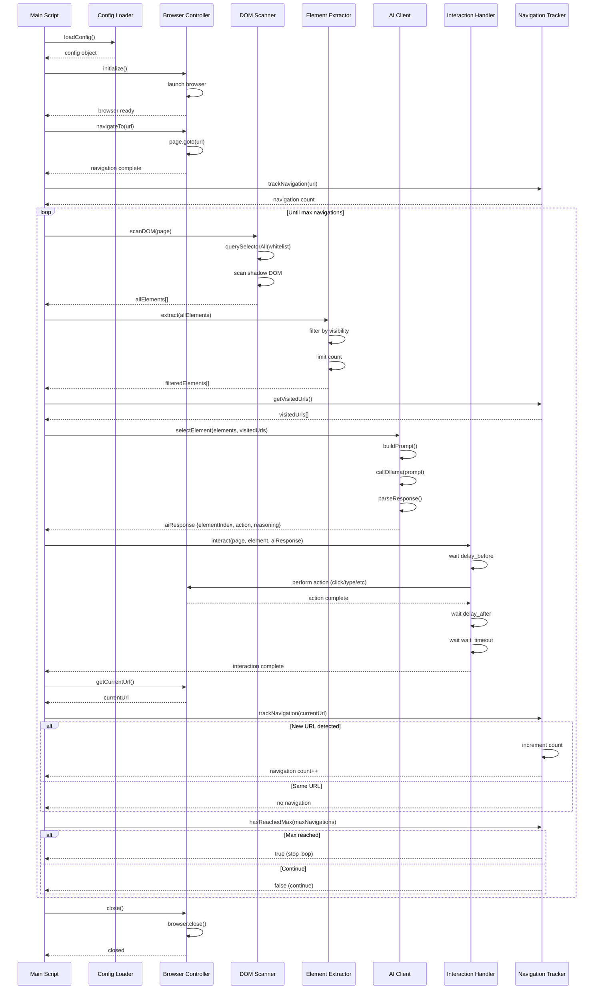

# Cohort QA Architecture

## Overview

Cohort QA is an AI-powered web exploration system that automatically navigates through web applications by:
1. Scanning the DOM for interactable elements
2. Using AI to select which element to interact with
3. Performing the interaction
4. Tracking navigations until a limit is reached

## Component Architecture

```
┌─────────────────────────────────────────────────────────────────┐
│                         Main Script (index.ts)                   │
│                    Orchestrates the entire flow                  │
└────────────────────────────┬────────────────────────────────────┘
                             │
        ┌─────────────────────┼─────────────────────┐
        │                       │                     │
        ▼                       ▼                     ▼
┌──────────────┐      ┌──────────────┐      ┌──────────────┐
│   Config     │      │   Browser    │      │   Scanner    │
│   Loader     │      │  Controller  │      │   (DOM)      │
└──────────────┘      └──────────────┘      └──────────────┘
                             │
        ┌─────────────────────┼─────────────────────┐
        │                       │                     │
        ▼                       ▼                     ▼
┌──────────────┐      ┌──────────────┐      ┌──────────────┐
│  Extractor   │      │  AI Client   │      │ Interaction  │
│  (Guardrails)│      │  (QWEN 2.5)  │      │   Handler    │
└──────────────┘      └──────────────┘      └──────────────┘
                             │
                             ▼
                    ┌──────────────┐
                    │ Navigation   │
                    │   Tracker    │
                    └──────────────┘
```

## Component Responsibilities

### Config Loader (`config.ts`)
- Loads and parses `config.yaml`
- Provides configuration to all components
- Validates configuration structure

### Browser Controller (`browser/BrowserController.ts`)
- Manages Playwright browser instance
- Handles page navigation
- Provides page access to other components
- Manages browser lifecycle (init/close)

### DOM Scanner (`scanner/DOMScanner.ts`)
- Scans the DOM including shadow DOM
- Uses whitelist selectors from config
- Extracts interactable element information
- Returns structured element data

### Element Extractor (`extractor/ElementExtractor.ts`)
- Applies guardrails to extracted elements
- Filters by visibility (if configured)
- Limits number of elements (max_elements)
- Returns filtered element list

### AI Client (`ai/AIClient.ts`)
- Communicates with Ollama API
- Sends element list and context to AI model
- Parses AI response (JSON)
- Returns structured interaction decision

### Interaction Handler (`interaction/InteractionHandler.ts`)
- Performs browser interactions (click, type, select, etc.)
- Handles interaction delays
- Manages error recovery
- Waits for page changes after interaction

### Navigation Tracker (`tracker/NavigationTracker.ts`)
- Tracks visited URLs
- Normalizes URLs for comparison
- Counts navigation events
- Determines when max navigations reached

## Execution Flow

### Sequence Diagram



## Data Flow

### Element Data Structure

```
InteractableElement
├── index: number
├── tag: string
├── type?: string (for inputs)
├── text?: string
├── selector: string
├── href?: string
├── id?: string
├── className?: string
├── ariaLabel?: string
├── role?: string
├── isVisible: boolean
└── boundingBox?: {x, y, width, height}
```

### AI Request/Response

**Request to AI:**
- System message (instructions)
- List of interactable elements with metadata
- Visited URLs list
- Instructions for JSON response format

**Response from AI:**
```json
{
  "elementIndex": 5,
  "action": "click",
  "value": null,
  "reasoning": "This link leads to a new page with product details"
}
```

## Configuration Flow

All components receive the `Config` object which contains:

```yaml
browser:          # Browser settings
navigation:       # Navigation limits
element_extraction:  # Whitelist selectors, visibility, max elements
ai:              # AI model settings, prompts
interaction:     # Delays and timeouts
```

## Error Handling

- **Browser errors**: Caught in main script, browser is closed gracefully
- **AI errors**: Logged, script continues (would need fallback strategy)
- **Interaction errors**: Logged with fallback selectors attempted
- **DOM scanning errors**: Individual selector errors are ignored, continues scanning

## State Management

- **Navigation state**: Managed by `NavigationTracker` (visited URLs, count)
- **Browser state**: Managed by `BrowserController` (page, context, browser instance)
- **Configuration state**: Loaded once at startup, shared across components

## Extension Points

The architecture supports extension through:

1. **Additional AI providers**: Extend `AIClient` with new provider methods
2. **Custom selectors**: Modify `include_selectors` in config
3. **New interaction types**: Add methods to `InteractionHandler`
4. **Additional guardrails**: Extend `ElementExtractor` filtering logic
5. **Custom navigation tracking**: Extend `NavigationTracker` with custom URL normalization
6. **Parallel execution**: See [MULTITHREADING_ANALYSIS.md](MULTITHREADING_ANALYSIS.md) for parallel exploration strategies

