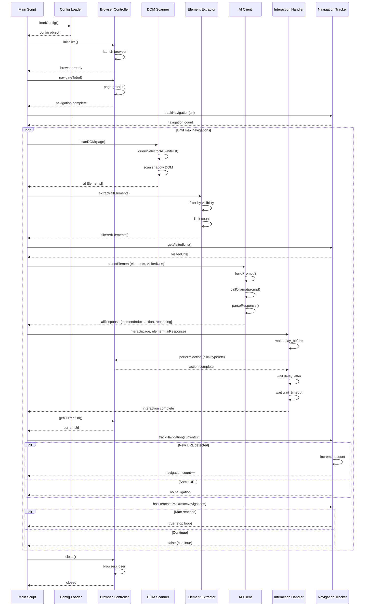

# Cohort QA Architecture

## Overview

Cohort QA is an AI-powered web exploration system that automatically navigates through web applications by:
1. Scanning the DOM for interactable elements
2. Using AI to select which element to interact with
3. Performing the interaction
4. Tracking navigations until a limit is reached

## Component Architecture

The system is organized into two main components:

### Planner Component (`src/planner/`)

```
┌─────────────────────────────────────────────────────────────────┐
│                    Planner (planner/index.ts)                    │
│              Orchestrates web exploration flow                    │
└────────────────────────────┬────────────────────────────────────┘
                             │
        ┌─────────────────────┼─────────────────────┐
        │                       │                     │
        ▼                       ▼                     ▼
┌──────────────┐      ┌──────────────┐      ┌──────────────┐
│   Config     │      │   Browser    │      │   Scanner    │
│   Loader     │      │  Controller  │      │   (DOM)      │
└──────────────┘      └──────────────┘      └──────────────┘
                             │
        ┌─────────────────────┼─────────────────────┐
        │                       │                     │
        ▼                       ▼                     ▼
┌──────────────┐      ┌──────────────┐      ┌──────────────┐
│  Extractor   │      │  AI Client    │      │ Interaction  │
│  (Guardrails)│      │ (Ollama/LM)   │      │   Handler    │
└──────────────┘      └──────────────┘      └──────────────┘
                             │
                             ▼
                    ┌──────────────┐
                    │ Navigation   │
                    │   Tracker    │
                    └──────────────┘
                             │
                             ▼
                    ┌──────────────┐
                    │  Test Plan   │
                    │  Generator   │
                    └──────────────┘
```

### Generator Component (`src/generator/`)

```
┌─────────────────────────────────────────────────────────────────┐
│                  Generator (generator/index.ts)                  │
│            Converts test plans to Playwright tests               │
└────────────────────────────┬────────────────────────────────────┘
                             │
        ┌─────────────────────┼─────────────────────┐
        │                       │                     │
        ▼                       ▼                     ▼
┌──────────────┐      ┌──────────────┐      ┌──────────────┐
│ Test Plan    │      │ Playwright   │      │   Config     │
│  Parser      │      │  Generator   │      │   Loader     │
└──────────────┘      └──────────────┘      └──────────────┘
```

## Component Responsibilities

### Planner Components (`src/planner/`)

#### Config Loader (`planner/config.ts`)
- Loads and parses `config.yaml`
- Provides configuration to all components
- Validates configuration structure

#### Browser Controller (`planner/browser/BrowserController.ts`)
- Manages Playwright browser instance
- Handles page navigation
- **Sets cookies before page load** (via JavaScript injection and Playwright API)
- Provides page access to other components
- Manages browser lifecycle (init/close)

#### DOM Scanner (`planner/scanner/DOMScanner.ts`)
- Scans the DOM including shadow DOM
- Respects blacklisted tags (ignores element and all children)
- Uses `interactable_elements` selectors from config (whitelist approach)
- Extracts interactable element information
- **Collects notable elements** for AI analysis
- Returns structured element data

#### Element Extractor (`planner/extractor/ElementExtractor.ts`)
- Applies guardrails to extracted elements:
  - **Domain restriction**: Prevents navigation away from starting domain
  - **Path restriction**: Enforces `stay_on_path` if configured
  - **Visited URL avoidance**: Filters out links to already visited URLs
  - **Random hash ID filtering**: Removes unstable selectors
- Filters by visibility (if configured)
- Limits number of elements (max_elements)
- Returns filtered element list

#### AI Client (`planner/ai/AIClient.ts`)
- Communicates with AI providers (Ollama or LM Studio)
- Sends element list and context to AI model
- **Identifies notable elements** on pages
- Parses AI response (JSON)
- Returns structured interaction decision

#### Interaction Handler (`planner/interaction/InteractionHandler.ts`)
- Performs browser interactions (click, type, select, etc.)
- **Handles shadow DOM elements** with recursive search
- Handles interaction delays
- Manages error recovery
- Waits for page changes after interaction

#### Navigation Tracker (`planner/tracker/NavigationTracker.ts`)
- Tracks visited URLs
- Normalizes URLs for comparison
- Counts navigation events
- Determines when max navigations or max loops reached

#### Planner Main (`planner/index.ts`)
- Orchestrates the exploration flow
- Generates test plan in markdown format
- Tracks loop summaries and timing
- Outputs summary table at end of run

### Generator Components (`src/generator/`)

#### Test Plan Parser (`generator/TestPlanParser.ts`)
- Reads and parses `test-plan/test-plan.md`
- Extracts start URL, steps, actions, and expected results
- Parses element information (selector, text, href, XPath, ID, etc.)
- Parses notable elements and key elements

#### Playwright Generator (`generator/PlaywrightGenerator.ts`)
- Generates Playwright test code from parsed test plan
- **Smart locator generation** with multiple strategies:
  1. ID (most specific)
  2. XPath (very specific)
  3. Selector + href + text (most specific combination)
  4. Selector + href (exact match)
  5. Selector + text
  6. Href + text filtering
  7. Text-based role locators (with exact matching)
- **Cookie setup**: Generates cookie configuration matching planner
- Creates descriptive test and describe block names
- Generates assertions for URLs, titles, and notable elements

#### Generator Main (`generator/index.ts`)
- Entry point for generator script
- Loads config for cookie settings
- Orchestrates parsing and generation
- Outputs test file with timestamp-based naming

## Execution Flow

### Sequence Diagram



## Data Flow

### Element Data Structure

```
InteractableElement
├── index: number
├── tag: string
├── type?: string (for inputs)
├── text?: string
├── selector: string
├── href?: string
├── id?: string
├── className?: string
├── ariaLabel?: string
├── role?: string
├── isVisible: boolean
└── boundingBox?: {x, y, width, height}
```

### AI Request/Response

**Request to AI:**
- System message (instructions)
- List of interactable elements with metadata
- Visited URLs list
- Instructions for JSON response format

**Response from AI:**
```json
{
  "elementIndex": 5,
  "action": "click",
  "value": null,
  "reasoning": "This link leads to a new page with product details"
}
```

## Configuration Flow

All components receive the `Config` object which contains:

```yaml
start_url:        # URL to start exploration from
stay_on_path:     # Optional path restriction

browser:          # Browser settings
  cookies:        # Array of cookie objects to set
  headless:       # Headless mode
  timeout:        # Browser timeout

navigation:       # Navigation settings
  max_navigations: # Maximum URL changes
  max_loops:      # Maximum loop iterations
  stay_on_domain: # Restrict to starting domain
  wait_after_navigation: # Wait time after navigation

element_extraction:  # Element extraction settings
  interactable_elements: # Selectors for interactable elements (whitelist)
  blacklist_tags:    # HTML tags to ignore
  notable_elements:  # Selectors for notable element identification
  enable_notable_elements: # Enable/disable notable elements
  include_invisible: # Include invisible elements
  max_elements:      # Maximum elements to extract

ai:              # AI model settings
  provider:      # "ollama" or "lmstudio"
  model:         # Model name
  base_url:      # API base URL
  temperature:   # Model temperature
  max_tokens:    # Maximum tokens
  max_elements_in_prompt: # Limit elements sent to AI
  prompt:        # System message and instructions

interaction:     # Interaction settings
  delay_before:  # Delay before interaction
  delay_after:   # Delay after interaction
  wait_timeout:  # Wait timeout
```

## Error Handling

- **Browser errors**: Caught in main script, browser is closed gracefully
- **AI errors**: Logged, script continues (would need fallback strategy)
- **Interaction errors**: Logged with fallback selectors attempted
- **DOM scanning errors**: Individual selector errors are ignored, continues scanning

## State Management

- **Navigation state**: Managed by `NavigationTracker` (visited URLs, count)
- **Browser state**: Managed by `BrowserController` (page, context, browser instance)
- **Configuration state**: Loaded once at startup, shared across components

## Test Plan Format

The planner generates a markdown test plan (`test-plan/test-plan.md`) with the following structure:

```markdown
# Test Plan

**Start URL**: https://example.com

## Steps to Reproduce

### Step 2: CLICK

**Action:** click on element
- **Selector**: `a.link-unstyled.font-md`
- **Text**: "Investing"
- **Link**: https://example.com/investing
- **XPath**: `/html/body/div[1]/a[2]`

**Expected Results:**
- **URL**: https://example.com/investing
- **Page Title**: "Investing - Example"
- **Notable Elements**:
  - `#main-heading` "Investing" - Main page heading
  - `.button-primary` "Get Started" - Call to action button
```

The generator reads this format and converts it to executable Playwright tests.

## Extension Points

The architecture supports extension through:

1. **Additional AI providers**: Extend `AIClient` with new provider methods (e.g., OpenAI, Anthropic)
2. **Custom selectors**: Modify `interactable_elements` and `notable_elements` in config
3. **New interaction types**: Add methods to `InteractionHandler`
4. **Additional guardrails**: Extend `ElementExtractor` filtering logic
5. **Custom navigation tracking**: Extend `NavigationTracker` with custom URL normalization
6. **Custom locator strategies**: Extend `PlaywrightGenerator.generateLocator()` with new strategies
7. **Test plan format**: Modify test plan structure and parser
8. **Parallel execution**: See [MULTITHREADING_ANALYSIS.md](MULTITHREADING_ANALYSIS.md) for parallel exploration strategies

