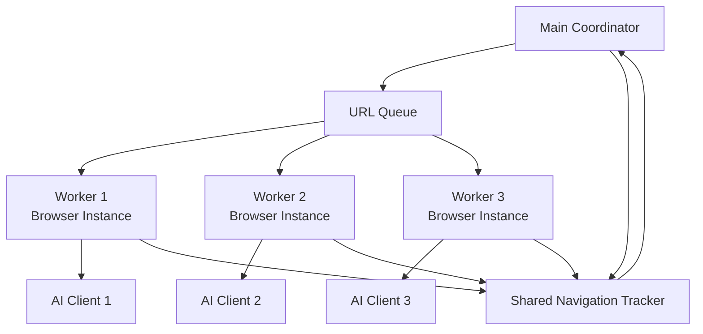

# Multi-Threading Analysis

## Current Architecture

The system currently operates in a **sequential, single-threaded** manner:
1. Scan DOM → 2. Extract elements → 3. Call AI → 4. Interact → 5. Track navigation → Repeat

All operations happen in the Node.js event loop (single-threaded with async I/O).

## Bottlenecks Identified

### 1. **AI API Calls** (Primary Bottleneck)
- **Time**: 1-5+ seconds per call (depending on model size)
- **Nature**: Network I/O, waiting for AI inference
- **Impact**: High - blocks the entire loop

### 2. **Browser Interactions** (Secondary Bottleneck)
- **Time**: 500ms - 3+ seconds (page loads, network requests)
- **Nature**: Network I/O, waiting for page state
- **Impact**: Medium - necessary sequential operations

### 3. **DOM Scanning** (Minor Bottleneck)
- **Time**: 50-500ms (depending on page complexity)
- **Nature**: CPU-bound DOM traversal
- **Impact**: Low - relatively fast

## Multi-Threading Opportunities

### ✅ **High Value: Parallel Browser Instances**

**Concept**: Run multiple browser instances exploring different pages simultaneously.

```
┌─────────────────────────────────────────────────────────┐
│              Main Coordinator                            │
│  ┌──────────┐  ┌──────────┐  ┌──────────┐            │
│  │ Browser  │  │ Browser  │  │ Browser  │            │
│  │ Instance │  │ Instance │  │ Instance │            │
│  │    1     │  │    2     │  │    3     │            │
│  └──────────┘  └──────────┘  └──────────┘            │
│       │              │              │                   │
│       └──────────────┼──────────────┘                   │
│                      ▼                                   │
│              Shared Navigation Tracker                   │
└─────────────────────────────────────────────────────────┘
```

**Benefits**:
- Explore multiple paths simultaneously
- Faster coverage of the application
- Better utilization of AI API (multiple concurrent calls)

**Implementation**:
- Use Node.js `worker_threads` or `cluster` module
- Each worker manages its own browser instance
- Shared state for navigation tracking (thread-safe)
- Queue-based URL distribution

**Challenges**:
- Coordination between workers
- Shared navigation tracking (needs locking)
- Resource usage (memory, CPU)
- More complex error handling

**Estimated Speedup**: 3-5x (with 3-5 parallel instances)

---

### ✅ **Medium Value: Parallel AI Evaluation**

**Concept**: Evaluate multiple potential actions in parallel, then select the best.

```
Current:  Scan → Extract → AI (pick 1) → Interact
Proposed: Scan → Extract → AI (evaluate top 3 in parallel) → Select best → Interact
```

**Benefits**:
- Better decision quality (compare multiple options)
- Faster than sequential evaluation
- Can use different AI strategies in parallel

**Implementation**:
- Make multiple AI calls in parallel using `Promise.all()`
- Each call evaluates a subset of elements
- Aggregate results and select best option

**Challenges**:
- Increased AI API load
- More complex selection logic
- May not always be faster (if AI API is the bottleneck)

**Estimated Speedup**: 1.5-2x (if AI API supports concurrent requests)

---

### ⚠️ **Low Value: Worker Threads for DOM Scanning**

**Concept**: Offload DOM scanning to worker threads.

**Reality Check**:
- DOM scanning is already fast (50-500ms)
- Playwright's `page.evaluate()` already runs in browser context
- Overhead of worker thread communication may outweigh benefits
- Browser automation is inherently sequential per page

**Verdict**: **Not recommended** - complexity not worth the minimal gain.

---

### ⚠️ **Low Value: Background Element Extraction**

**Concept**: Pre-process elements while waiting for AI response.

**Reality Check**:
- Element extraction is CPU-bound but very fast (<10ms)
- No significant waiting time to parallelize
- Current sequential flow is already optimal

**Verdict**: **Not recommended** - no meaningful benefit.

---

## Recommended Approach: Hybrid Parallel Exploration

### Architecture



### Implementation Strategy

#### Phase 1: Parallel Browser Instances (High Impact)

```typescript
// Pseudo-code structure
class ParallelExplorer {
  private workers: BrowserWorker[];
  private navigationTracker: SharedNavigationTracker;
  private urlQueue: URLQueue;
  
  async explore(url: string, maxNavigations: number) {
    // Initialize multiple browser workers
    this.workers = await Promise.all(
      Array(3).fill(null).map(() => this.createWorker())
    );
    
    // Start exploration from initial URL
    this.urlQueue.enqueue(url);
    
    // Run workers in parallel
    await Promise.all(
      this.workers.map(worker => worker.explore(this.urlQueue, this.navigationTracker))
    );
  }
}

class BrowserWorker {
  async explore(queue: URLQueue, tracker: SharedNavigationTracker) {
    while (!tracker.hasReachedMax()) {
      const url = await queue.dequeue();
      if (!url) break;
      
      // Full exploration loop for this URL
      await this.explorePage(url, tracker);
    }
  }
}
```

**Key Components**:
1. **URL Queue**: Thread-safe queue for distributing URLs
2. **Shared Navigation Tracker**: Thread-safe counter and URL set
3. **Worker Pool**: Fixed number of browser instances

**Configuration**:
```yaml
parallel:
  enabled: true
  worker_count: 3  # Number of parallel browser instances
  max_concurrent_ai_calls: 3
```

#### Phase 2: Parallel AI Evaluation (Medium Impact)

Within each worker, evaluate top candidates in parallel:

```typescript
async selectElement(elements: InteractableElement[], visitedUrls: string[]) {
  // Select top 3 candidates based on heuristics
  const candidates = this.selectTopCandidates(elements, 3);
  
  // Evaluate all candidates in parallel
  const evaluations = await Promise.all(
    candidates.map(candidate => 
      this.evaluateElement(candidate, elements, visitedUrls)
    )
  );
  
  // Select best based on AI reasoning
  return this.selectBest(evaluations);
}
```

## Implementation Considerations

### Node.js Threading Options

1. **Worker Threads** (`worker_threads`)
   - ✅ True parallelism (separate V8 instances)
   - ✅ Shared memory with `SharedArrayBuffer`
   - ⚠️ More complex communication
   - **Best for**: CPU-intensive tasks, parallel browser instances

2. **Cluster Module** (`cluster`)
   - ✅ Process isolation
   - ✅ Automatic load balancing
   - ⚠️ Higher memory overhead
   - **Best for**: Simple parallelization, separate processes

3. **Promise.all() for I/O**
   - ✅ Simple async parallelization
   - ✅ No threading overhead
   - ❌ Still single-threaded (event loop)
   - **Best for**: Parallel AI API calls, parallel network requests

### Thread Safety Requirements

1. **Navigation Tracker**
   - Use `Mutex` or `Atomics` for shared state
   - Or use a message-passing architecture

2. **URL Queue**
   - Use thread-safe queue implementation
   - Or use Redis/database for distributed queue

3. **Configuration**
   - Read-only after initialization (safe to share)

### Resource Management

- **Memory**: Each browser instance uses ~100-200MB
- **CPU**: Browser automation is I/O-bound, not CPU-bound
- **Network**: AI API may need rate limiting
- **File Descriptors**: Each browser instance opens multiple FDs

## Performance Estimates

### Current (Sequential)
- **Time per iteration**: ~2-8 seconds
  - DOM scan: 0.1-0.5s
  - AI call: 1-5s
 - Interaction: 0.5-2s
- **10 navigations**: ~20-80 seconds

### With 3 Parallel Browsers
- **Time per iteration**: ~2-8 seconds (same per instance)
- **3x throughput**: 3 pages explored simultaneously
- **10 navigations**: ~7-27 seconds (3x faster)

### With Parallel AI Evaluation
- **Time per iteration**: ~1.5-6 seconds (1.3x faster per instance)
- **Combined with 3 browsers**: ~5-18 seconds for 10 navigations

## Recommendations

### ✅ **Implement First**: Parallel Browser Instances
- **Impact**: High (3-5x speedup)
- **Complexity**: Medium
- **Risk**: Low (isolated failures)

### ✅ **Implement Second**: Parallel AI Evaluation
- **Impact**: Medium (1.3-2x speedup per instance)
- **Complexity**: Low (just Promise.all)
- **Risk**: Low (fallback to sequential if needed)

### ❌ **Skip**: Worker Threads for DOM Scanning
- **Impact**: Low (<10% improvement)
- **Complexity**: High
- **Risk**: Medium (threading bugs)

## Code Structure Preview

```
src/
├── parallel/
│   ├── ParallelExplorer.ts      # Main coordinator
│   ├── BrowserWorker.ts         # Individual browser worker
│   ├── URLQueue.ts              # Thread-safe URL queue
│   └── SharedNavigationTracker.ts  # Thread-safe tracker
├── utils/
│   └── threadSafe.ts            # Mutex, locks, etc.
└── ...
```

## Conclusion

**Yes, there are significant multi-threading opportunities**, primarily:

1. **Parallel browser instances** - Explore multiple pages simultaneously (3-5x speedup)
2. **Parallel AI evaluation** - Evaluate multiple options concurrently (1.3-2x speedup)

The combination could provide **4-10x overall speedup** for exploring large applications.

The main challenge is coordination and thread safety, but these are well-solved problems in Node.js.

