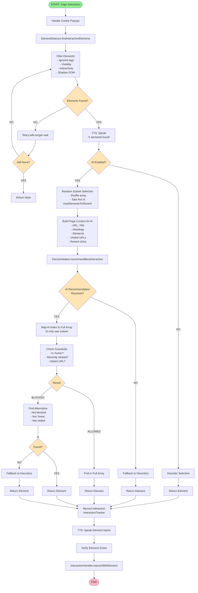
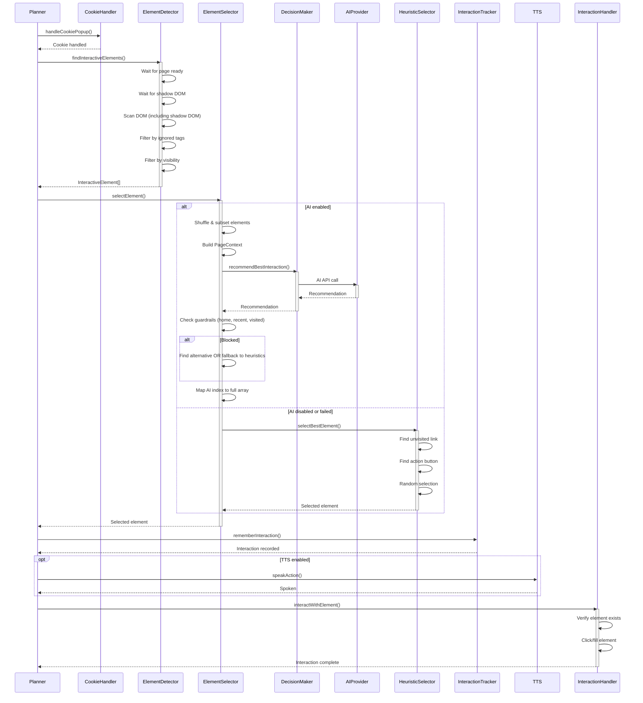

# Planner Element Selection Decision Tree

This document describes the decision-making process for selecting which interactive element to click during web application exploration.

## Overview

The planner uses a multi-stage decision process to select elements, with AI-powered selection when available and heuristic fallbacks when not. The process includes duplicate avoidance, guardrails, and intelligent filtering.

## Decision Flow Diagram



## Detailed Decision Points

### 1. Element Detection (`ElementDetector.findInteractiveElements()`)

**Input:** Page object, base origin URL

**Process:**
1. Wait for page to be ready (`domcontentloaded`)
2. Wait for shadow DOM custom elements (if present)
3. Trigger lazy loading by scrolling
4. Wait for interactive elements to appear
5. Scan DOM (including shadow DOM traversal)
6. Filter elements:
   - **Exclude elements in ignored tags:** `<header>`, `<aside>`, `<footer>`, `dbs-top-bar` (configurable)
   - **Check visibility:** Must be visible (not `display: none`, `visibility: hidden`, opacity > 0)
   - **Check interactivity:** Must be clickable (buttons, links, inputs with proper roles)
   - **Exclude destructive actions:** Skip buttons with "delete" + "remove" in text

**Output:** Array of `InteractiveElement[]`

**Fallback:** If `page.evaluate()` fails, use Playwright's `locator` API

---

### 2. Random Subset Selection (AI Mode Only)

**When:** AI is enabled and elements are found

**Process:**
1. Shuffle the full array randomly: `[...elements].sort(() => Math.random() - 0.5)`
2. Take first N elements: `shuffled.slice(0, maxElementsToShowAI)`
   - Default: `maxElementsToShowAI = 10` (configurable in `config.yaml`)

**Why:** 
- Reduces AI processing time
- Provides variety across runs (randomization)
- Prevents AI from always seeing the same first elements

**Output:** Subset of elements to show to AI

---

### 3. AI Decision Making (`DecisionMaker.recommendBestInteraction()`)

**Input:** `PageContext` containing:
- URL, title, headings
- Subset of elements (with indices)
- Visited URLs
- Target navigations, current navigations
- Recent interaction keys (last 5 clicks)

**Process:**
1. Build prompt with context
2. Send to AI provider (OpenAI, Anthropic, or Ollama)
3. AI analyzes elements and returns:
   - `elementIndex` (relative to subset)
   - `reasoning` (why this element was chosen)

**Output:** `Recommendation | null`

**Fallback:** If AI fails or returns null → Use heuristics

---

### 4. Guardrails & Duplicate Avoidance

**When:** AI recommends an element

**Checks:**

1. **"Homey" Check:**
   - Element text contains "home" (case-insensitive)
   - OR element is a link to the initial URL

2. **Recent Interaction Check:**
   - Element key is in recent interaction history (last 10 clicks)
   - Interaction key = `{type}-{text}-{href}` (normalized)

3. **Visited URL Check:**
   - Element href (normalized) is in visited URLs set

**If Blocked:**
- Find alternative element that passes all checks
- If no alternative found → Fallback to heuristics

**If Allowed:**
- Map AI index back to full array
- Find element in full array by:
  1. Matching href (for links) - most reliable
  2. Matching text (case-insensitive)
  3. Matching selector (fallback)

---

### 5. Heuristic Selection (`HeuristicSelector.selectBestElement()`)

**When:** 
- AI is disabled
- AI fails or returns null
- AI recommendation is blocked and no alternative found

**Priority Order:**

1. **Unvisited Navigation Links:**
   - Find links that navigate to unvisited pages
   - Skip: JavaScript links, hash-only links, empty links
   - Prefer: Links with meaningful text (1-50 chars)
   - Prefer: Links that navigate (not just hash anchors)

2. **Action Buttons:**
   - Find buttons with action words: `submit`, `search`, `login`, `next`, `continue`, `go`, `view`, `see`, `explore`, `browse`, `shop`, `add`, `create`, `start`, `begin`, `apply`

3. **Random Selection:**
   - If no unvisited links or action buttons found
   - Select random element from available elements

---

### 6. Interaction Recording

**After Selection:**

1. **Record Interaction:**
   - `InteractionTracker.rememberInteraction(element, historySize)`
   - Stores interaction key in recent history
   - Default history size: 20 (configurable)

2. **Log Selection:**
   - Current URL
   - Number of available elements
   - Selected element type and text
   - Selection method (AI, heuristic, etc.)

3. **TTS Announcement:**
   - Speak element name with dynamic prefix (if TTS enabled)

---

### 7. Element Interaction

**Before Click:**
- Verify element exists: `InteractionHandler.verifyElementExists()`

**Interaction:**
- Click buttons/links: `element.click()`
- Fill inputs: `element.fill(value)`
- Handle navigation: Wait for URL change or network idle

**Error Handling:**
- If click fails → Return `false`
- Planner will retry or try different element

---

## Configuration Options

All decision points can be configured in `config.yaml`:

```yaml
planner:
  maxElementsToShowAI: 10        # Number of elements to show AI
  ignoredTags:                   # Tags to ignore during detection
    - header
    - aside
    - footer
    - dbs-top-bar
    # Note: 'nav' was removed to allow navigation menu interactions
  recentInteractionHistorySize: 20 # How many recent clicks to remember
```

## Code References

- **Element Detection:** `src/planner/elements/ElementDetector.ts`
- **Element Selection:** `src/planner/utils/ElementSelector.ts`
- **AI Decision Making:** `src/ai/DecisionMaker.ts`
- **Heuristic Selection:** `src/ai/HeuristicSelector.ts`
- **Interaction Tracking:** `src/planner/utils/InteractionTracker.ts`
- **Interaction Handling:** `src/planner/interactions/InteractionHandler.ts`

## Sequence Diagram



## Key Design Decisions

1. **Random Subset for AI:**
   - Prevents AI from always seeing the same elements
   - Reduces processing time
   - Maintains variety across runs

2. **Guardrails:**
   - Prevents infinite loops (clicking "home" repeatedly)
   - Avoids duplicate interactions
   - Ensures exploration of new pages

3. **Graceful Degradation:**
   - AI → Heuristics → Random
   - Always finds an element if available
   - Never gets stuck

4. **Interaction Tracking:**
   - Short-term memory (last 10-20 clicks)
   - Prevents immediate repetition
   - Allows revisiting after exploration

5. **Shadow DOM Support:**
   - Recursive traversal of shadow roots
   - Handles modern web components
   - Fallback to Playwright locators if needed

